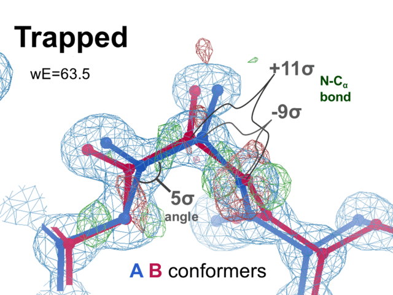
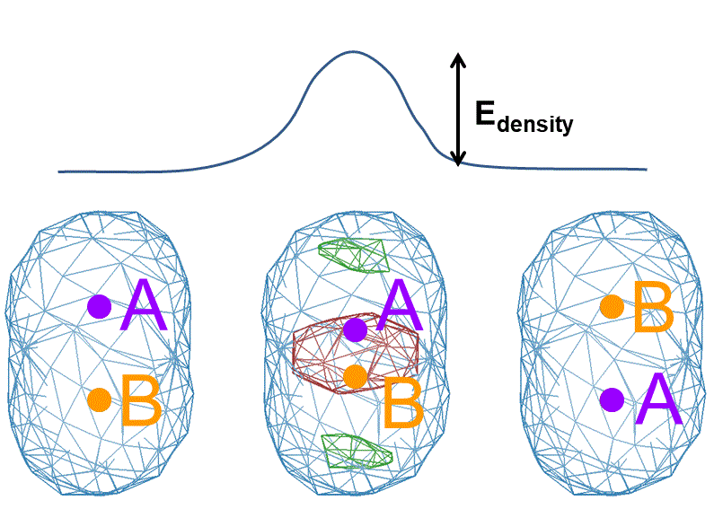

# UnTangle
Challenge data set for multi-conformer macromolecular model building
<HTML>
<HEAD>
</HEAD>
<BODY>

<H1 ALIGN=CENTER>The UNTANGLE Challenge</H1>
<H3 ALIGN=CENTER>May the Force Field Be Your Guide</H3>

image not switching between "trapped" and "correct"? <a href=sidebyside.gif>click here</a>. 
 <small>Underlying data extend to 1.0 A resolution, blue map is 2mFo-DFc contoured at 1.0x rmsd, red and green are mFo-DFc contoured at 3.5 x rmsd.</small>

<h2>Why?</h2>

Everybody knows that macromolecules adopt multiple conformations. That is how they function.  And yet, ensemble refinement has never been all that much better than conventional single-conformer-with-a-few-split-side-chain models when it comes to revealing correlated motions, or even just simultaneously satisfying density data and chemical restraints. That is, ensembles still suffer from the battle between R factors and geometry restraints. This is because the ensemble member chains cannot pass through each other, and get <a href=#tangle>tangled</a>. The tangling comes from the density, not the chemistry. Refinement in refmac, shelxl, phenix, simulated annealing, qFit, and every feature of coot I've tried cannot untangle them. 

The good news is: knowledge of chemistry, combined with R factors, appears to be a powerful indicator of how close a model is to being untangled. What is really exciting is that the genuine, underlying ensemble is, by definition, not tangled. The true ensemble defines the density; it is not being fit to it. The more untangled a model gets the closer it comes to the true ensemble, with deviations from reasonable chemistry becoming easier and easier to detect. In the end, when all alternative hypotheses have been eliminated, the model must match the truth.

 To demonstrate, I have created a series of examples that are progressively more difficult to solve, but the ground truth model and density is the same in all cases. Build the right model, and it will not only explain the data to within experimental error, and have the best possible validation stats, but it will reveal the true, underlying cooperative motion of the protein as well.

Unless, of course, you can prove me wrong?

<H2>The challenge:</h2>
The <a href=refme.mtz>density data</a> for this challenge is simulated, but the problem to be solved is very real. Without a well-known <a href=ground_truth.pdb>ground truth</a> model there is no hope of solving it, so we begin with the simplest, easiest possible situation: 1.0 A data, perfect phases, excellent geometry, and the simpest possible ensemble: an ensemble of two.

<H3>Level 0: Cheating</h3>
Refine the model in <tt><a href=best.pdb>best.pdb</a></tt> against the data in <tt><a href=refme.mtz>refme.mtz</a></tt>. You will find they agree fantastically. Not just Rfree=3.1% but all validation metrics are excellent. There are three rare rotamers, but all three are clearly supported by the density. I have combined many geometry validation scores into a unified, weighted energy (wE, described below), which for this model is wE=18.27. There is nothing wrong with this structure. It matches the underlying ground-truth, and it also conveys a cooperative whole-molecule transition between the two underlying states.

Why can't we do this with real data? Because our models need to be untangled.

<H3>Level 1: One thing wrong: Ala39 - bond stretch</h3>
Now refine <tt><a href=otw39.pdb>otw39.pdb</a></tt> against the same data as before: <tt><a href=refme.mtz>refme.mtz</a></tt>. This model has exactly the same atoms as <tt><a href=best.pdb>best.pdb</a></tt> with exactly the same connectivity, but refined from a different starting position. The stats are nottably worse: Rfree=3.4%, wE=63.5. Several geometry outliers are striking, such as the N-Ca bond of Ala39, which is 11 sigmas too long. It may surprise many that refinement does not fix this: not refmac5, not coot, not shelxl, not phenix.refine, simulated annealing or any standard protocols therein can turn <tt><a href=otw39.pdb>otw39.pdb</a></tt> into <tt><a href=best.pdb>best.pdb</a></tt>, despite them being rms 0.02 A different. <tt><a href=otw39.pdb>otw39.pdb</a></tt> is trapped in a local minimum. Good news is: both the difference map and the geometry outliers are screaming about where the problem is, and you only need to do one thing to fix it: the <a href=#weightsnap>weight snap trick</a>. After that, the model refines to a structure essentially identical to <tt><a href=best.pdb>best.pdb</a></tt>, and has wE=18.2 again. For this reason, this level of the UNTANGLE challenge is now solved.

<H3>Level 2: One thing wrong: Val1 - clash</h3>
The model <tt><a href=otw1.pdb>otw1.pdb</a></tt> is also trapped in a local minimum. Again, it has same atoms as <tt><a href=best.pdb>best.pdb</a></tt>, and, again, no refinement program can escape the trap, not with default parameters, anyway. The higher stats:  Rfree=3.4%, wE=24.8 arise mainly from a Molprobity clash between Val1 and a nearby water (S56). The ground truth has no clashes. Unlike <tt><a href=otw39.pdb>otw39.pdb</a></tt>, however, the <a href=#weightsnap>weight snap trick</a> does not work. After a weight snap, this model ends up back to where it started. What is needed here is a <a href=#confswap>conformer swap trick</a>. It is tempting to swap water S56, but that leads to two clashes, and the score rises to wE=27. The thing to do here is swap the conformers of the entire Val1 side chain and re-refine. Then there are no clashes, and the angle and torsion stats within Val1, although not bad, get markedly better after the swap. The result, as above, is identical to <tt><a href=best.pdb>best.pdb</a></tt>. Challenge is: other than trial-and-error, how would you escape this trap?

<H3>Level 3: Lots of things wrong</h3>
The model <tt><a href=lotswrong.pdb>lotswrong.pdb</a></tt> is trapped in a local minimum similar to the one-thing-wrong levels. Again, it has the same atoms as <tt><a href=best.pdb>best.pdb</a></tt>, and, again, no refinement program can escape the trap. The stats: Rfree=4.4% and wE=104 are much higher because instead of just one group of atoms to swap, there are 129 atoms in 75 residues (43 protein, 32 water) that need swapping. In its current state, this model has six clashes, 6-sigma bond and angle deviates, bad CB deviations, and many other problems. But, simply swap the right conformer letters and re-refine and you get <tt><a href=best.pdb>best.pdb</a></tt>. The Challenge is to figure out which ones to swap. I'm not going to tell you.

<H3>Level 4: Anisotropic B factors</h3>
The ground truth of this challenge has all isotropic B factors, but two conformers of every atom. In many cases these alternates are close together and the traditional way of modelling that situation is an anisotropic B factor. This also has the advantage of reducing the number of bonds, angles and other entities that can go wrong. And, perhaps more, the fused alt conformers are intrinsically "untangled". By starting with a fully 2-strand model and fusing nearby atoms, I managed to arrive at <tt><a href=fused.pdb>fused.pdb</a></tt>, with Rfree=6.6%, and wE=59.8. Winning the challenge from here means splitting all the 1-conformer atoms and guessing right at their A-B assignments.

<H3>Level 5: Start with a manually-built model</h3>
Starting with the qFit model below, Tom Peat and I did some back-and-forth manual model building and produced <tt><a href=manual_built.pdb>manual_built.pdb</a></tt>. This model is in a state where I think most people would call it "done", with Rfree=4.56%, and wE=81.5. As usual, most of the problems are clashes and non-bond interactions, but there are clear bond, angle and torsion deviations with a twisted peptide and some bad CB deviations. This situation is much more reflective of real-world models than the above Levels. Some might suspect this is not realistic because Rfree is so low. This is due to not just the data extending to 1.0 A resolution, but because the ground-truth bulk solvent is flat. I could have made the ground-truth solvent more realistic, but that would just make this challenge harder, and I think it is already hard enough.

<H3>Level 6: Start with <a href=https://pubmed.ncbi.nlm.nih.gov/33210433/>qFit</a></h3>
One of the few programs written especially for multi-conformer model building is qFit. The best model I have obtained with it is here: <tt><a href=qfit_best.pdb>qfit_best.pdb</a></tt>, with Rfree=9.3%, and wE=97.3. Clearly some work remains to be done, and qFit is only intended to be a starting point. So, you may want to start here.

<H3>Level 7: Start with phenix.autobuild model</h3>
The output of phenix.autobuild <tt><a href=phenix_autobuild.pdb>phenix_autobuild.pdb</a></tt> has an excellent wE=18.1, which sounds like a champoin until you look at Rwork=17.9% and Rfree=18.4%. These are decent R factors for a normal structure, but very large when compared to best.pdb. The difference map also has huge peaks. This is because phenix.autobuild only builds one conformer. If you start here you will need to build the other one.

It is because of models like this that I extended the overall score to include a term containing Rfree. But practically, as long as you don't have glaring difference peaks in your maps, wE is the most useful guide. 

<H3>Level 8: Start with traditional ensemble refinement</h3>
Ensemble refinement is a natural choice when you are looking for an ensemble, so I ran phenix.ensemble_refine with the deposited 1aho structure and otherwise default parameters. The output is here: <tt><a href=phenix_ensemble.pdb>phenix_ensemble.pdb</a></tt>. Its stats: Rfree=9.4% and wE=109.7 are similar but slightly worse than those from qFit. Using this as a starting point, however, may be tricky because the file contains 100 models.

<H3>Level 9: Long-range traps</h3>
Starting with <tt><a href=longrangetraps.pdb>longrangetraps.pdb</a></tt>, a model with wE=22.8, Rfree=3.4% may sound like a good choice, but it is deceptive. Swapping conformers of any single atom in this model does not improve wE because large stretches of the model are swapped in A-B conformation assignements relative to <tt>best.pdb</tt>.  That is, if we call the correlated movements in <tt>best.pdb</tt> "jumping jacks", then <tt><a href=longrangetraps.pdb>longrangetraps.pdb</a></tt> is the "windshield wiper" model of the same average density. You will have to find a way to choose large groups of atoms without getting too many of them wrong. This model was created using <a href=#simanneal>simulated annealing and "back crossing"</a>, where any atoms knocked out of density or into bad geometry by the SA run were simply restored to their original positons, and the SA repeated. The result has a very good wE score, but still not as good as <tt>best.pdb</tt>. 

<H3>Level 10: Let the Force Field be your guide</h3>
This is the real challenge: build a model into <tt><a href=refme.mtz>refme.mtz</a></tt> that has as-good or better R factors and validation statistics as <tt><a href=best.pdb>best.pdb</a></tt> using your favorite model building and refinement method (no cheating, of course).

<H3>Level 11: Alternative hypothesis</h3>
This one may be impossible: Build a model into <tt><a href=refme.mtz>refme.mtz</a></tt> that is <b>not</b> equivalent to <tt><a href=best.pdb>best.pdb</a></tt> but has as-good or better R factors and validation statistics. That is, find a model that conveys different correlated motions, like "windshield wipers" are to "jumping jacks", but scores just as well. Cheat if you can. 

Summary table of stats: 
<TABLE border=1>
<TR align=center valigh=center>
    <td>score  </td><td> wE    </td><td> Rwork </td><td> Rfree </td><td> model            </td><tr> 
<tr><td> 18.6  </td><td> 18.27 </td><td> 2.79  </td><td> 3.14  </td><td> best (cheating)  </td></tr> 
<tr><td> 21.9  </td><td> 21.36 </td><td> 3.12  </td><td> 3.48  </td><td> longrangetraps   </td></tr> 
<tr><td> 25.3  </td><td> 24.85 </td><td> 3.00  </td><td> 3.33  </td><td> onethingwrong1   </td></tr> 
<tr><td> 59.81 </td><td> 54.58 </td><td> 5.87  </td><td> 6.57  </td><td> fused            </td></tr> 
<tr><td> 63.47 </td><td> 63.46 </td><td> 1.60  </td><td> 1.79  </td><td> onethingwrong39  </td></tr> 
<tr><td> 85.53 </td><td> 18.13 </td><td> 17.91 </td><td> 18.42 </td><td> phenix_autobuild </td></tr> 
<tr><td> 93.38 </td><td> 92.26 </td><td> 3.70  </td><td> 4.12  </td><td> manual_built     </td></tr> 
<tr><td> 105.1 </td><td> 103.7 </td><td> 3.94  </td><td> 4.38  </td><td> lotswrong        </td></tr> 
<tr><td> 110.5 </td><td> 97.33 </td><td> 8.84  </td><td> 9.27  </td><td> qfit_best        </td></tr> 
<tr><td> 123.5 </td><td> 109.6 </td><td> 8.87  </td><td> 9.44  </td><td> ensemble_refine  </td></tr> 
</table>

<h2>Scoring System</h2>

  This c-shell script <tt><a href=untangle_score.csh>untangle_score.csh</a></tt> implements the scoring function for this challenge, which is a weighted energy (wE). The script requies the Phenix suite, gnuplot and /bin/tcsh to be installed in order to work. Once those are set up, simply provide your refined PDB file as an argument on the command line and the script will run a variety of validation programs. It will print out the combined, weighted energy score (wE), as well as one-line summaries of the average and worst outlier for each validation metric. It should look like this:

<pre>
using R/Rfree from manual_built.pdb
ramalyze
rotalyze
omegalyze
cbetadev
molprobity
geometry
0.183454 927    avg_bond    
9.21571 48 avg_nonbond 
-0.303795 29237 avg_full_nonbond 
3.58846 4   avg_clash   
0.691348 1280   avg_angle   
0.917184 564 avg_torsion  
0.136204 115  avg_chiral    
0.0935015 1113   avg_plane   
1.86711 119   avg_omega   
0.547737 96    avg_rota
0.796894 119    avg_rama    
2.48353 99      avg_CBdev
4.96 -0.031 1.360 1.329 0.014 | C_63 N_64     bond
334.594 0.818 1.282 2.100 1 | HZ2_2 HG1_57  nonbond
36.4278 4x 8.85695 0.632 | A 10 AVAL HG23| A 12 ACYS SG    clash
21.3 9.69 94.51 104.20 2.1 | CB_16 SG_16 SG_36    angle
10.9 -8.24 -114.36 -122.60 2.5 | C_63 N_63 CA_63 CB_63  torsion
1.52 0.25 2.26 2.51 0.2 | CA_9 N_9 C_9 CB_9   chiral
6.76 -0.052 0.052 0 0.02 | N_4    plane
12.9324 9 0 omega= 165.42    omega
4.87154 8 A 8 BASP:0.18:-87.07:-151.71:Allowed:General 0.9982     rama
5.41378 12 A 12 BCYS:0.50:0.1:253.7::::OUTLIER:OUTLIER 0.999     rota
17.64 63 manual_built :A:cys: A: 63 : 0.210: 118.44: 0.50:A:       CBdev
weighted energy (wE): 92.2579
1.23 2.37 334.594 4.96 21.3 10.9 1.52 6.76 14.58 4.87154 5.41378 17.64     9.21571 0.183454 0.691348 0.917184 0.136204 0.0935015 1.86711 0.796894 0.547737 2.48353   manual_built
93.3762 92.2579 3.701 4.115 n/d n/d n/d 0 1.23 2.37 334.594 4.96 21.3 10.9 1.52 6.76 14.58 4.87154 5.41378 17.64 9.21571 0.183454 0.691348 0.917184 0.136204 0.0935015 1.86711 0.796894 0.547737 2.48353 manual_built  n/d n/d 
</pre>
 The first word on each line is the unweighted energy (squared sigma deviate) associated with the metric named as the last word on each line, so you can <tt>sort -g</tt> the output to see what needs fixing the most. The stuff in between is: deviate, model, ideal, sigma, then abbreviated info on which atoms are involved. The very last line lists all validation stats at once, beginning with the combined score of wE plus Rfree. Rfree itself is the 4th word, Molprobity score is 9th, etc.

If you have trouble running this script, please try re-running it, but add <tt>debug=1</tt> on the command line and send me a copy of the files called <tt>tempfile*</tt> that it will write to the working directory. You can also send your prized model to me and I can run this for you.

<h4>How does it work?</h4>
  There are many validation metrics for macromolecular model quality, and they all have different units. Here I posit a combined, weighted energy (wE) score to combine and balance them so that trade-offs can be judged automatically. For bond, angle, plane, torsion and chiral center deviations, I extract a statistical potential from <tt>phenix.geometry_minimization</tt>. This energy is: 
 
where the sigma (&sigma;) (taken from Phenix) is the rms deviation expected of the bond, angle, etc. <i>v0</i> is the ideal value and <i>v</i> the value in the model. The ground truth here has no significant deviations from ideality. For non-bonded interactions, I use a <a href=https://en.wikipedia.org/wiki/Lennard-Jones_potential>Lennard-Jones 6-12 potential</a>, wich has a much stronger penalty for clashes than the 4th-power anti-bumping typically used in refinement. I also add an extra penalty for each <a href=http://molprobity.biochem.duke.edu/>Molprobity</a> clash. The ground truth here has no clashes. I further add an extra penalty for twisted peptide bonds (omega). The ground truth has no peptides twisted more than 9 deg. The probabilities output by <tt>molprobity.ramalyze</tt> and <tt>molprobity.rotalyze</tt> are converted into a sigma-scaled deviate and therefore energy using the <a href=https://en.wikipedia.org/wiki/Error_function#Inverse_functions>inverse error function</a>. The ground truth has three unpopular rotamers. <a href=https://pubmed.ncbi.nlm.nih.gov/12557186/>C-beta deviations</a> also contribute a statistical energy with a presumed sigma=0.05 A. In this way, all validation metrics are all converted into statistical energies, which are now on the same scale.

There is a problem, however, with statistical energies, and that is that they tolerate huge outliers in large systems. For example, the odds of a 6-sigma bond deviation occuring by chance are about 1 in 500,000,000. That basically never happens. And yet, if 36 1-sigma deviations can be reduced to zero by creating a 6-sigma deviate, a statistical energy considers that an even trade-off. That makes no sense to me, so I weight each energy by considering the probability that it could have occurred by random chance.  That is, 6-sigma deviates get a weight of 1.0, and all 1-sigma deviates get a weight near zero.  More precisely, I use a 
<tt><a href=https://en.wikipedia.org/wiki/Chi-squared_test>&chi;2 test</a></tt>
 for the average/sum of each energy type, and for the maximum-deviating outlier in each category I use the frequency of the largest Gaussian deviate that occurs in N trials:
  
Where <tt>Pnn</tt> is the "probability its not noise", <tt>erf()</tt> is the integral over a normalized Gaussian, and <tt>Nthings</tt> is the number of bonds, angles, etc in each category. 

A few instructive examples of <tt>Pnn</tt> are warranted: 
 If there is only one bond, and it is deviating from ideality by 0.67x sigma, then that energy (<tt>0.67^2 = 0.45</tt>) gets a weight of 0.5, for a total wE contribution of <tt>0.45*0.5 = 0.22</tt>. But, if 0.67-sigma is the worst of two bonds, that gets a weight of 0.25. If it is the worst of 5, then the weight is 3%, and if 0.67-sigma is the worst outlier of 10 bonds, that gets a weight of 0.1%. On the other hand, a 4-sigma outlier gets a weight of 1.0 unless there are quite a few other bonds. If there are 10,000 bonds, you expect to see a random biggest-deviate of 4 sigmas or more about 53% of the time.  So, 0.53 becomes the weight. The result is that wE tends to be dominated by the worst outliers, but random fluctuations of not-so-bad things cannot mask them.

One problem with <tt>Pnn</tt>, however, is that for large <tt>Nthings</tt> it becomes very very sharp. Sharp enough that the uncertainty in the exact value of the sigma deviate itself can dominate a decision. To make <tt>Pnn</tt> reflect the finite precision of sigma deviates I replace <tt>Pnn</tt> in practice with a 5th-power polynomial that passes through the point where <tt>Pnn</tt>=50%. So, the sigma deviate that gets a weight of 0.5 is given by <tt>Pnn</tt>, but the overall curve is smooth. 
Another problem with these energy-based weights is that very large outliers tends to wash out all other considerations. For example, a worst outlier going from 100 sigmas to 99 sigmas subtracts 199 energy "points", which is far more than the 7 "point" penalty of increasing a 3-sigma outlier to 4. This is not so bad in principle, but the problem is that real structures do contain actual outliers that are supported by the density, like the three rare rotamers in the ground truth of this challenge. Genuine outlers should not confound optimization of the 2nd-worst thing, so curtail this effect, all unweighted energies greater than 10 are replaced with a logarithmic dependence:
  
 This is a smooth and monotonic truncation that allows optimization in the context of outliers. The wE score can therefore be interpeted as 10x the number of potentially worrisome things in the structure.  The full equation for wE in each validation category is therefore:
  
and the wE reported by the script is simply the sum over all categories: bonds, angles, torsions, planes, chirality, non-bond, rotamers, ramachandran angles, omega peptide bond twists,
and CB-deviations. 
Finally, for an overall Challenge score, Rfree must be considered. If you have gigantic difference features in your Fo-Fc map, then you have not arrived at the correct ensemble. Strictly speaking, <tt>Pnn</tt> and &chi;2 could be used on difference map features, but for now I simply add a noise-offset energy derived from Rfree to wE to form a combined score: 
  

Where &sigma;R is the Rfree expected due to  experimental error only. In the implementation here &sigma;R = 2%. Although algebraically unorthodox, the shape of this function approximately matches a &chi;2-weighted Rfree, in practice it serves only to penalize structures that have not been fully built into density.

<h2>Some tricks that have helped so far:</h2>

<h3>Don't bother refining occupancies</h3>
Early feedback has revealed the most annoying thing about this challenge data is a "water-cannon" effect where the partially-occupied waters go crazy and fly far from their ideal positions, no doubt due to clashes. Sometimes this arises because refmac turns on vdw repulsion for any atoms whose occupancies sum to greater than 1.00, regardless of their conformer letters. None of the 79 ground-truth waters have a combined occupancy greater than 1.00, but 39 of them sum to less than unity. Finding the correct occopancies requires refinement, but small errors in that refinement can tip the sum above 1.00, and create a water cannon.

The aim of this challenge is not water torture, so I declare here that it is <b>not cheating</b> to use the prior knowledge that the protein ensemble is exactly 50:50. You may also use the correct water occupancies in <tt><a href=ground_truth_water.pdb>ground_truth_water.pdb</a></tt>. Refmac does not refine occupancies by default, but Phenix does. So, to turn off occupancy refinement in Phenix, use this input file <tt><a href=noocc.eff>noocc.eff</a></tt>. Getting the solvent right is a challenge all unto itself, but for now lets focus on the protein.

<h3>Hold water</h3>
As a further measure to prevent water torture, I am providing these convenient input files to help make waters hold still. In fact, you are welcome to cheat a little and use the <tt><a href=ground_truth_water.pdb>ground_truth_water.pdb</a></tt> positions and occupancies in your starting model, as was done with <tt><a href=manual_built.pdb>manual_built.pdb</a></tt>.  

In phenix, you can restrain waters to stay near their starting positions with harmonic restraints with <tt><a href=phenix_holdwater.eff>phenix_holdwater.eff</a></tt>, but what you really want to do sometimes is make the two alternate locations stay together. The input file <tt><a href=phenix_holdwater_dist.eff>phenix_holdwater_dist.eff</a></tt> will do this.
 For refmac, the keywords in <tt><a href=refmac_holdwater.txt>refmac_holdwater.txt</a></tt> defines harmonic restraints and <tt><a href=refmac_holdwater_dist.txt>refmac_holdwater_dist.txt</a></tt> is the keyworded input file to used to fix distances between alternate conformers of the water. It may also be interesting to "pinch" the waters by changing all the distances in the restraint files to zero, and then later extending them to see which way they roll.

<h3>Do not build more than two conformers</h3>
I know how tempting it can be to get rid of a clash with a water by simply pushing the water into a parallel Universe called "Conformer C". However, the <i>reductio-ad-absurdum</i> of this strategy is to give every atom in the structure a different conformer letter. Then there are no clashes at all, and indeed no non-bonded interactions of any kind. That would be cheating. Occam's Razor applies to alternative hypotheses, and you are allowed to know that the ground truth here has only two conformations. This is an advantage, not a handicap. There is at least one 2-conformer structure that has no clashes, and looking for a 3-conformer solution will take you far into the wrong direction without a good road back. That is my advice.

<h3>Weight snap</h3>
All refinement programs allow the user to intervene in the weight given to the density term vs the geometry restraints. People don't usually do this, but they really should. Up-weighting the geometry term will make wE better, and in many cases improvements remain when the weight balance is returned to normal. With phenix.refine this can be done by specifying <tt>wxc_scale=0.1</tt> for about 10 macro-cycles, and then returning it to the default <tt>wxc_scale=0.5</tt> for another ten. In refmac, increase the geometry weight with <tt>weight matrix 0.05</tt> and then back to the default, which is <tt>weight auto</tt>. It can also be helpful to crank up the density weight, and indeed ramping it gently up and down can release traps that survive a sharper transition. Always a good idea to try if you have not done it yet.

<h3>Conformer swap</h3>
A potentially very powerful "move" in untangling ensembles is to force the chains to pass through each other. This can be done by simply editing the conformer letters assigned to the two alternate locations of an unhappy atom. That is: change "A" to "B" and "B" to "A". In coot, you change conformer letters using the <tt>Edit:Residue Info...</tt> menu. A conveient command-line script for doing this is provided in <tt><a href=swapconf.csh>swapconf.csh</a></tt>. Run it with your pdb file on the command line and indicate one or two numbers to indicate the residue range you want to flip, along with an atom name as a separate argument, or one of these words: <tt>side</tt>, <tt>main</tt>. These will swap all the side-chain or main-chain atoms, respectively. You may also use words <tt>rotA</tt> or <tt>rotB</tt> to indicate an N,Q or H side chain in either the A or B conformer needs a 180-deg flip. Fpr example: 
<tt>swapconf.csh refmacout.pdb A56 CB</tt> 
will swap the conformer lettters assigned to the <tt>CB</tt> atom of residue 56 in chain A and write the result to a new file called <tt>swapped.pdb</tt>.

<h3>Simulated annealing with back-crossing</h3>
Although simulated annealing itself tends to make these scores worse, this is only because things can go wrong at random as well as going right. To combat this, a "back-crossing" approach can help. That is, you can identify atoms involved in bad geometry situations that were not in bad geometry in the input file. These atoms may be returned to their starting positions while atoms that went from bad to good are kept.  A few cycles of this may be needed, but some judgement must be used or it is easy to create new problems or just reject everything. A portable script for doing it is still in the works, so for the time being this is a suggested strategy.

<h2>Some things that have been tried and did not work</h2>

<h3>Alphafold2</h3>
The Alphafold2 prediction of this sequence has no strained rotamers.

<h3>Simulated Annealing</h3>
Standard simulated annealing with Phenix in my hands will invariably knock more atoms into the wrong place than it does into the right place. Even starting with the ground truth, wE never dipped much below 40, and the median wE was 172.  Simulated annealing with back-crossing, however was more effective, albeit pushing the model into a configuration that might be even harder to escape from.

<h2>What do you mean: tangled?</h2>

I can't believe how many years it took me to notice this, but two or more atoms in the same blob of density have a really hard time passing through each other. This is because the calculated electron density at the moment the two atoms are on top of each other is up to twice as high and twice as sharp as it is when they are separated. This poor agreement with the observed density is a significant barrier to optimization. As you can see in this figure: 
 
No matter what you call the two atoms: A and B, or B and A, together they will fit into oblong density. But, if you build A,B and the geometry term is better fro B,A then you are stuck. The density fit term of the optimization prevents them from crossing over. So, when you split a residue into two conformers, unless you get it right at that very moment, the refinement program is not going to be able to "figure it out" down the road. Sometimes weakening the density term with the <a href=#weightsnap>weight snap trick</a> can allow the barrier to be surmounted, and simulated annealing might get lucky. The <a href=#confswap>conformer swap trick</a> is an effective way to tunnel through the barrier, but there are a very large number of combinations of atoms to swap. Do you have any better ideas?

<h2>Where did these data come from?</h2>

  The structure factors in <tt><a href=refme.mtz>refme.mtz</a></tt> were calculated form an idealized version of the structure in <tt><a href=http://www.rcsb.org/pdb/explore/explore.do?structureId=1aho>1aho</a></tt>.  This particular PDB entry was selected because it is small, making refinement and other tasks fast, high-resolution to maximize probability of success, it has at least one instance of all 20 amino acids, it has disulfide bonds, and nothing else unusual. The ground truth model here is an ensemble, but to keep this challenge as simple as possible it is an ensemble of two. 

A hand-built 2-conformer model was refined loosely against the deposited 1aho data with restraints heightened to optimize validation scores. B factors were all isotropic and refined with elevated restraints. After this optimization the real data were discarded and the ground-truth structure factors in <tt><a href=refme.mtz>refme.mtz</a></tt> were calculated from the idealized ensemble model.  In other words, this challenge posits that the genuine underlying ensemble is chemically reasonable, even if we don't currently have the technology to extract it. 
In the ground truth of this challenge, there are exactly two copies of every atom, including the 79 waters. Protein occupancies are 50:50 and the waters are all 50% occupied or less to keep them from clashing in refmac. The bulk solvent is flat and generated using phenix.fmodel with <tt>k_sol=0.42 b_sol=45</tt> and otherwise default parameters. So, to match this in refmac you want to use <tt>solvent vdwprobe 1.1 ionprobe 1.1 rashrink 0.9</tt>, and for SHELXL you will want to import <tt><a href=solvent4shelx.fab>solvent4shelx.fab</a></tt> using the <tt>ABIN</tt> feature. 

Finally, Gaussian noise was added to the structure factors using the deposited <tt>SIGF</tt> values from the real <tt>1aho</tt> data as widths for the random number distributions. Reflections missing in the deposited data are also missing in the simulated data. The simulated data were then named <tt>F,SIGF</tt> in <tt><a href=refme.mtz>refme.mtz</a></tt>, and the uncorrupted phases included in both <tt>PHI/FOM</tt> and Hendrickson-Lattman coefficients. The noiseless structure factor amplitudes are also included under the label <tt>F0</tt>. You may use them, but it won't make much difference.

<h2>What constitutes "cheating"?</h2>
  For the results of this challenge to be useful 
(both those of us who use software and those who develop it) your solution to 
the problem must be a plausible "before you knew the right answer"
 scenario.  

For example, simply dropping in the "right answer" (<tt><a href=best.pdb>best.pdb</a></tt>) and refining is definitely cheating.

You are, however, allowed to cheat with the water. Feel free to use the ground truth positions and occupancies of ordered solvent in <tt><a href=ground_truth_water.pdb>ground_truth_water.pdb</a></tt>. Solvent structure is indeed a source of error, but for this challenge we aim to isolate the error of interest: local minima due to tangled protein chains.

Further peeking at the ground truth is prohibited until you get to Level 11. At this level you may cheat if you can. This is because I think Level 11 is impossible. Nevertheless, it remains a widely-held belief that any blob of density can be "over-fit" if your model has enough copies. This is that old observations/parameters chestnut, which is true for polynomials, but I maintain it is not for chemically reasonable molecular models. 
Don't believe me?  Try it! I encourage you and everyone you know to prove me wrong.

If you think you have found a way to build a model equivalent to best.pdb in Rfree and wE, without &quot;cheating&quot;, or, with cheating, a model that is better than best.pdb, let me know!  We will write that up together.

<ADDRESS><A HREF="mailto:JMHolton@lbl.gov">James Holton &lt;JMHolton@lbl.gov&gt;</A></ADDRESS>

</BODY>
</HTML>
